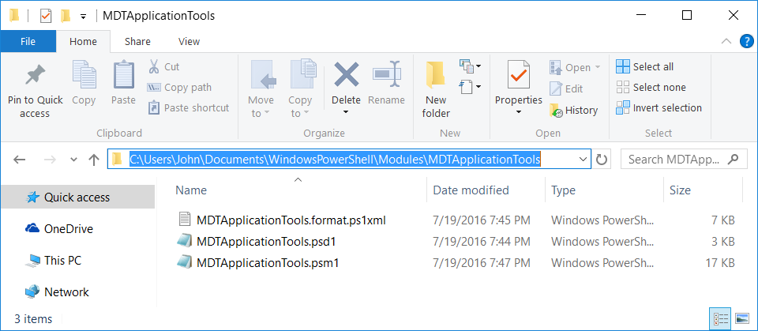
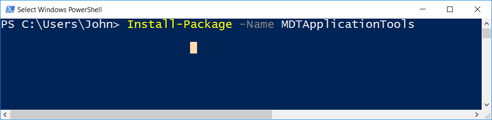

# MDT Application Tools
A PowerShell module to provide enhanced functionality around the querying and manipulation of MDT applications.

### Motivation
This module was created to provide some advanced functionality around the manipulation of MDT applications. Some of the Functions included are:

* Get-MDTApplication
  * Retrieves MDT applications, either by name/guid, or just all of them.
* Get-MDTApplicationDependency
  * Retrieves either the parent or child dependencies of an MDT application. Can either return one depth, or can recurse the entire depth of the dependency tree
* Get-MDTApplicationSupportedPlatform
  * Queries MDT applications to see if they have the SupportedPlatform attribute set.
* Set-MDTApplicationSupportedPlatform
  * Sets the SupportedPlatform attribute on MDT applications
* Find-MDTApplicationContent
  * Searches through either the installcmd attribute or the install scripts themselves of all the MDT applications in a share for the specified string(i.e "pause", "powershell.exe", "C:\Program Files (x86)", etc.)

### Prerequisites

In order to run this module, you'll need to at least have the **Microsoft Deployment Toolkit** installed. As of this writing the module has only been tested with **MDT 2013 Update 1** and **Update 2**, but may possibly work with earlier iterations of the toolkit. This module was developed on **Windows 10** using **PowerShell 5**. It will probably work just fine with earlier versions of Windows and PowerShell, but bear in mind those scenarios are untested.

###### MDT 2013 Update 1
http://www.microsoft.com/en-us/download/details.aspx?id=48595

###### MDT 2013 Update 2
http://www.microsoft.com/en-us/download/details.aspx?id=50407

### Installing

In order to install this module, just copy the module folder `MDTApplicationTools` (in order for the module to be imported it's contents must be in this folder) to one the folders in `$env:PSModulePath`.
Here's an example of what it should look like:

If you have PowerShell 5, you can also install it directly from the PowerShell Gallery.

### Updating Help
The help in this module is maintained with [platyPS](https://github.com/PowerShell/platyPS), which is a powershell module that lets you generate external powershell help files from easily maintained markdown file(s). In order to update the help in this module, simply edit the markdown file for the function in `.\docs` in the module's root directory, afterwards running `New-ExternalHelp .\docs -OutputPath en-US\ -Force`. This command will update the external help file for the module, `.\en-US\MDTApplicationTools-help.xml`.

### Authors

* **John Foret** - *Initial work* - [JohnForet](https://github.com/JohnForet)

### License

This project is licensed under the MIT License - see the [LICENSE.md](LICENSE.md) file for details

### Acknowledgments

Hat's off to Don Jones and Jeffrey Hicks *Learn Powershell Toolmaking in a Month of Lunches*, which helped me write this module. Also, kudos to Johan Arwidmark and Mikael Nystrom, both for the book *Deployment Fundamentals Vol 4: Deploying Windows 8 and Office 2013 Using MDT 2012 Update 1*, and for the support they provide to the windows deployment community.
